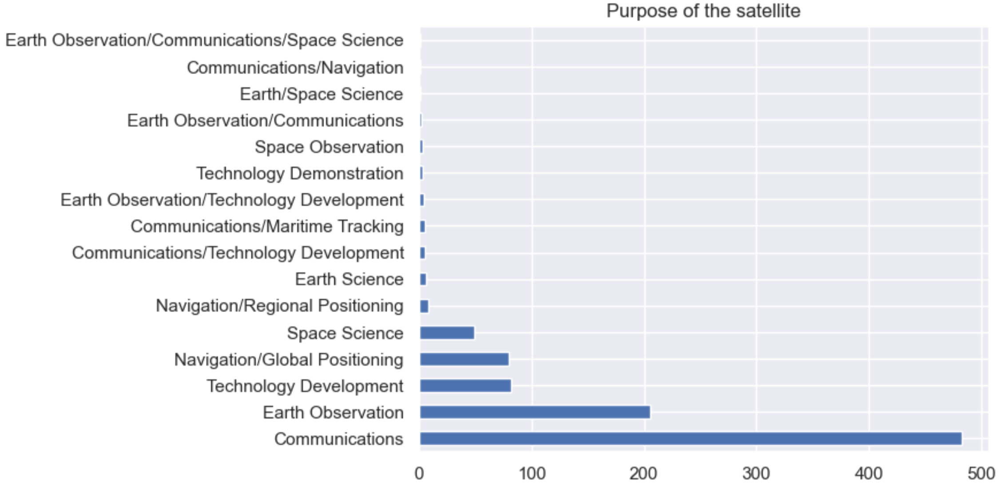
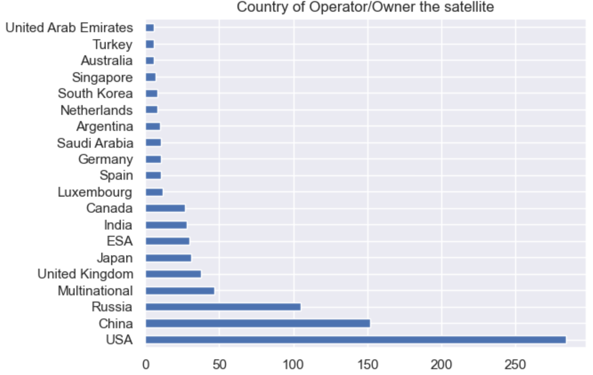
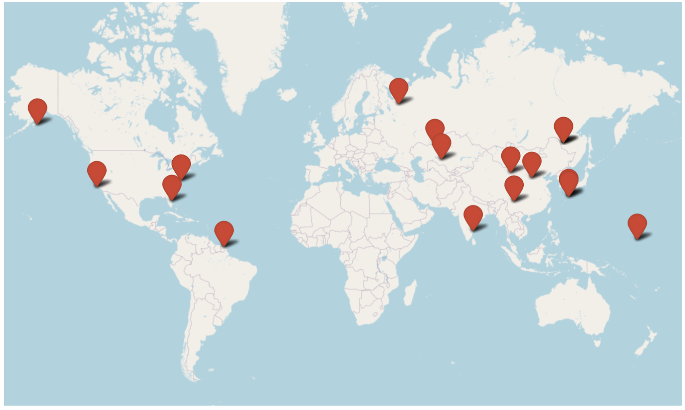
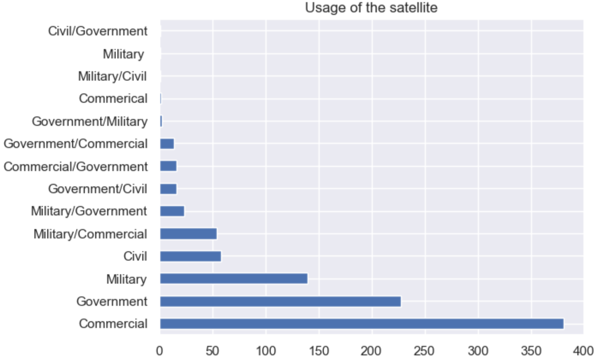
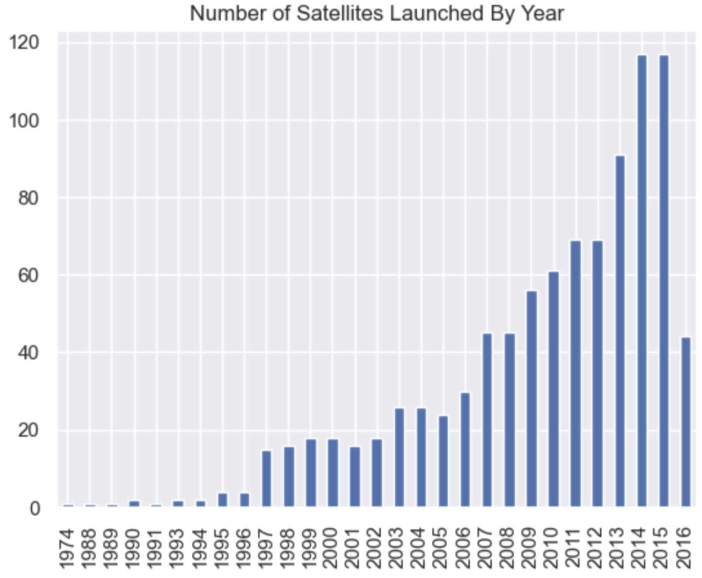

# Astro VIZards - Milestone 1

## Problematic

As the number of satellites orbiting the Earth continues to increase, tracking their movements and positions has become further important. Our satellite position visualization project aims to provide a dynamic and interactive way for our users to visualize the current positions of these objects in space by leveraging real-time data from various sources. We hope to further allow users to see the altitude, speed and other relevant information for the satellite of their choice.

The primary motivation behind our project is to make it easier for people to understand the movements of satellites and provide a unique perspective on the growing satellite industry. As previously discussed, with the increasing number of satellites being launched to space for various purposes, such as, communication, navigation and weather monitoring, there is a growing need for accurate and up-to-date information about their positions.

Our target audience includes space enthusiasts, researchers, students, and anyone interested in satellite tracking. We want to make this information accessible to a wider audience and spark interest and curiosity about the world of satellites. By providing a user-friendly and informative visualization of satellite positions, we hope to engage people who may not previously had an opportunity to learn about this fascinating area of technology and exploration.

Our main goal is to provide a clear and explanatory visualization of the satellite trajectories, their positions through time and other relevant information on a world map. Where the users will be allowed to search for the satellite of their interest, be it by name, by country or by purpose. Thanks to these intuitive filtering options, a user will be able to learn not just the purpose, location and other metadata about any satellite but also other general important information such as what is the most popular purpose for satellite usage, which countries have the most satellites and etc…

## Dataset

Our data will be information about satellites currently in orbit, that we will join together from two sources. First, we leverage the available information from a [Kaggle database](https://www.kaggle.com/datasets/ucsusa/active-satellites) that contains general information about them, including the reference number that uniquely identify the satellite.
Second, we need information about the orbits of the satellites that we gather from [NORAD](https://celestrak.org/NORAD/elements/table.php?GROUP=active&FORMAT=tle) in TLE format. An example is:

```
CALSPHERE 1             
1 00900U 64063C   23084.93269059  .00001383  00000+0  14568-2 0  9998
2 00900  90.1867  46.2036 0024102 255.4778 166.8391 13.74200379909312
```

This format encodes information about the name of the satellite, reference number (the same as in the other database), but also information about the orbit that can be used to compute its position at any time instant.

While the information contained in the TLE format is enough for the orbits, we join both sources by the reference number, allowing us to also plot extra information about the origin of the satellite or its usage. Not all the satellites in the database exists in NORAD data, but those are automatically filtered during the join. No extra preprocessing needs to be done with the original data.

## Exploratory Data Analysis

We used Pandas to analyze and explore the dataset. The notebook processing.ipynb can be found in our github repository, in the processing directory. The dataset contains `939` rows, each representing a single satellite. Each satellite entry has `26` columns, providing information about the satellites such as its name, owner, purpose, date of launch, its distance from the earth, etc. 
Below, we provide different visualizations belonging to our initial data exploration. 



The first visualization refers to the usage of the satellite. As expected, most of them belongs to communications, followed by earth observation (which includes meteorological satellites used for weather prediction). Surprisingly there are not so many satellites providing support for GPS network.



Another interesting metric is the owner/operator of the satellites: EEUU is the leader followed by China and Russia. Surprisingly, ESA (the european space agency) has not a great impact in the ownership of satellite given that it is a group of countries. 



This figure shows the launch sites of the satellites that we have in our dataset. The point on the right area of the map (above the sea) seems to be a old Oil Platform that was refurbished to be used as a launch place for satellites.



Understanding the usage of satellites also provides a nice overview of occupancy of the sky. Most of the satellites are for commercial use, followed by Governamental ones, and Military. By analyzing this data, one can conclude that there is a strong monetary interest in the information provided by satellites.



## Related work

Some of the current work available on this can be found below:	

* [Satellite Explorer](https://geoxc-apps.bd.esri.com/space/satellite-explorer/)
* [In the sky](https://in-the-sky.org/satmap_worldmap.php)
* [Satellite map](https://satellitemap.space/)

All of the above examples take a similar approach to the problem where they display a map of the world to the user along with the satellite positions on it. Because all of these websites take a similar approach, their errors are quite akin to each other as well. Some of the most important problems we have identified are as follows:
* The websites are missing a visually pleasing landing page, with explanations to help the user understand how to use the website.
* The visualizations that greet the user upon opening the website are either 
    * difficult to understand and interpret 
    * lacking in extensive filtering capabilities and other utilities
    * not up to modern website design standards

We hope to fix these mistakes by following modern design principles which will allow us to create a much more user friendly experience. Our project will not only display the information available on these above websites but also accommodate utilities that are much more expressive and thus give the user more power. Examples to these utilities are extensive filtering, graphing capability, and more.

